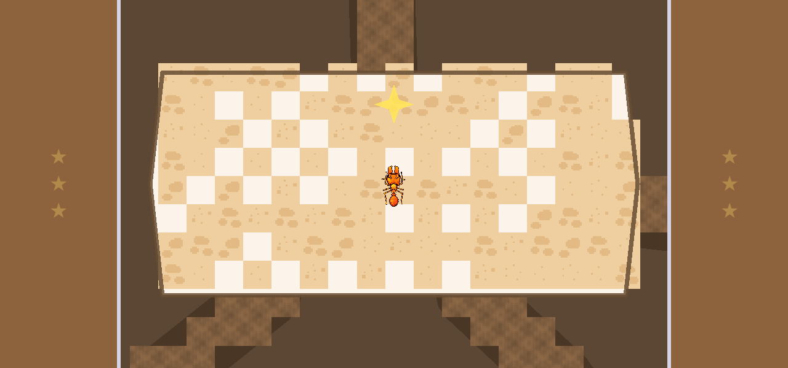
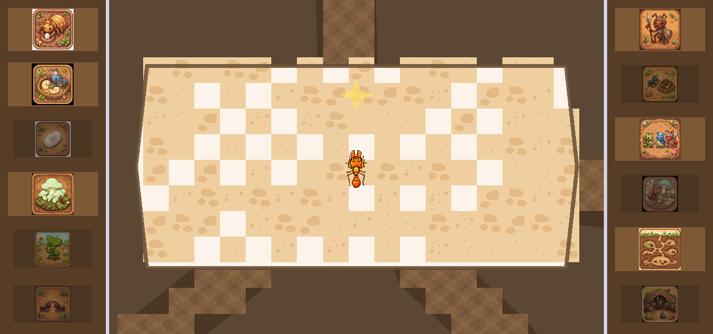
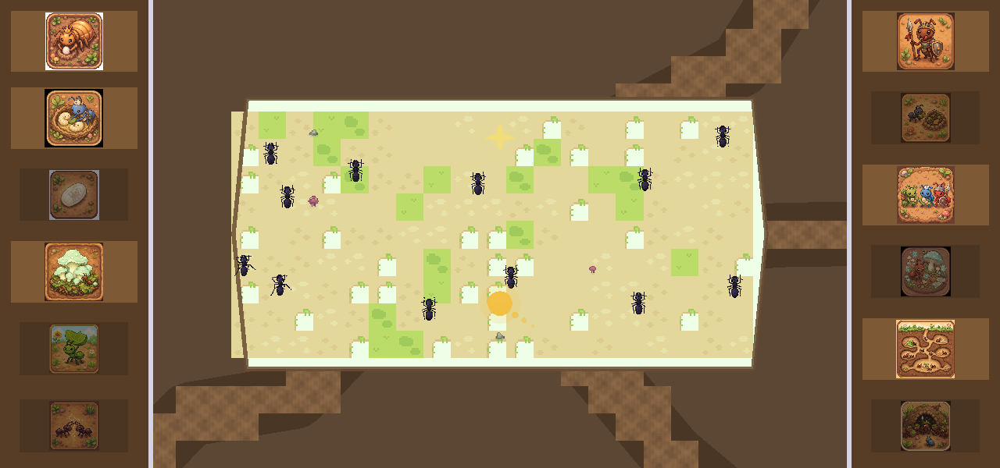
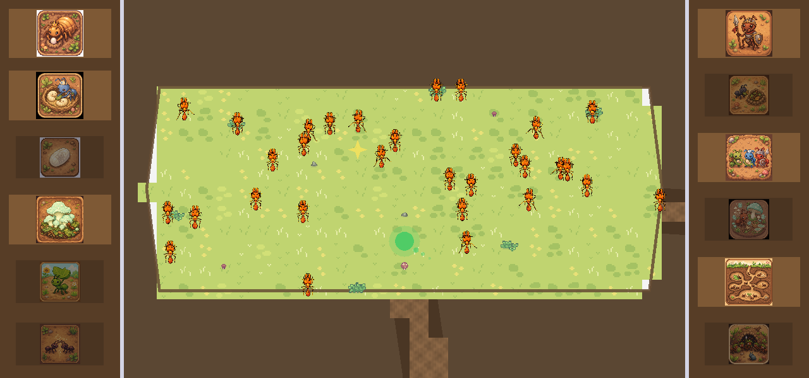
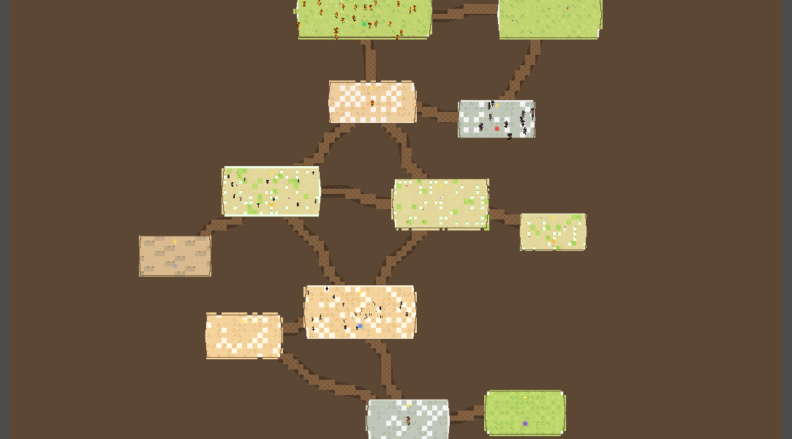

# Star Learner

**Star Learner is a homemade educational game console.**

Take an inexpensive Android phone, unlock the bootloader, root it, and lock it down so it no longer
behaves like a phone — it boots straight into a full-screen, landscape home shell that offers a
**curated catalog of educational games** and nothing else. No browser, no store, no notifications:
just a handful of hand-picked games a child can explore safely and offline.

Every game follows the **stars** format — short, high-quality documentary clips hidden as glowing
"knowledge stars" inside a playful, explorable world. Collect the stars, watch the clips, learn
something real. The catalog is **updated and expanded over the home network**, so new games and
fixes can reach a unit long after it is in a child's hands.

This repository holds the platform and the games. **Ant Explorer** is the first title.

- **Device + home app:** *Star Learner* (one thing a child can hold and boot into)
- **Platform / repo:** *star_learning* (holds many titles + shared tooling)
- **Format:** *stars* — offline documentary clips at knowledge nodes
- Naming details: [`NAMING.md`](NAMING.md)

---

## How a unit works

1. **Root + bootload.** Unlock the bootloader, patch `init_boot.img` with Magisk, and flash it so
   the device is rootable and controllable.
2. **Lock it into a console.** Force landscape, hide the status bar / gestures / app drawer, and
   install a minimal launcher so the device boots into the Star Learner home shell — a screen of
   game tiles and nothing else.
3. **Play offline.** Each game and all of its video/audio assets live on-device, so everything
   works with no network and no ads.
4. **Grow the catalog over the network.** Games and updates are delivered to each unit over the
   home network, letting the catalog expand and stay maintained after delivery.

Hardware target: Moto G Play 2024 (6.5″ 1600×720, Snapdragon 680, 4 GB). Build/lockdown notes live
in [`ant_explorer/docs/KIOSK_APPLIANCE.md`](ant_explorer/docs/KIOSK_APPLIANCE.md).

---

## Catalog

| # | Game | Tile | Status | Details |
|---|------|------|--------|---------|
| 1 | **Ant Explorer** | `ants` | ✅ Available | [full detail below](#1-ant-explorer) · [`ant_explorer/`](ant_explorer/) |
| 2 | **Solar System Explorer** | `planets` | ✅ Available | pick a world, plot a course, fly the 3D hop, park in orbit (Sun included — safe standoff) · [`solar_system_explorer/`](solar_system_explorer/) |
| 3 | **Math Explorer** | `preview` | 🔬 Preview | four tabs (`+ − × ÷`); numbers made visible as countable cubes; narrated, animated tutorials + sprite word problems · [`math_explorer/`](math_explorer/) |
| 4 | *(planned)* | — | 🕓 Idea | future title (e.g. bees, tide pools, the night sky) |

**Math Explorer** is a second *preview* title — a different subject (early math, not science) proving
the console spans domains. It makes numbers **visible**: `7 + 4` becomes seven red cubes and four
blue cubes, counted on together into gold. Four rounded tabs across the bottom cover addition,
subtraction, multiplication, and division; the design adds practice mode and sprite-driven word
problems (chickens & eggs, coins & change, sharing dolls, painting stones) plus a time-math thread.
Design: [`math_explorer/docs/STRATEGY_MATH_EXPLORER.md`](math_explorer/docs/STRATEGY_MATH_EXPLORER.md).

New titles are added as folders beside `ant_explorer/`, each a self-contained Godot project that
plugs into the Star Learner home shell and the stars format. **Solar System Explorer** is a second title on the console: it boots into the same landscape
shell and appears as its own tile — the **astronaut girl**, sat to the left of the ants and badged
full flyer. Its flow: START → a narrated top-down orrery (Sun, the eight planets, and the asteroid
belt) → an astronaut briefing that hands off to a horizontal **piloting** strip, where a spaceship
marker flies between bodies (speeding up, then easing in to land) and each stop opens a real 1–2
minute documentary clip — Sun through Pluto, plus the asteroid belt.

---

## 1. Ant Explorer

> *A birthday present for my daughter whose fascination with ants inspires me.*

A calm, exploratory **leaf-cutter ant colony simulator**. Your daughter controls one worker ant in
a living nest: tap the ground to walk, follow glowing pheromone trails to join colony jobs, and
stop beside golden **knowledge stars** to watch short ant documentaries. Exploration is the loop;
learning is the reward.

- **Engine:** Godot **4.3** (Mobile renderer), landscape, offline-first.
- **Assets:** Sprout Lands tileset · Kenney UI/fonts · baked ElevenLabs narration · Theora (`.ogv`)
  documentary clips.
- **Project folder:** [`ant_explorer/`](ant_explorer/) — see its
  [`README`](ant_explorer/README.md) for developer specifics.

### Core loop

- **Move:** tap a spot; the ant walks there, routing room → tunnel → room along the nest graph.
- **Join a job:** tap a glowing pheromone trail to take on that role (forage, garden, nurse,
  defend, …) alongside the NPC ants.
- **Learn:** walk up to one of the **12 golden stars** hidden in the nest; stopping beside it plays
  a short (1–4 min) documentary, then that star lights up on the side shelf. Collect all 12.
- **No reading required:** every prompt is spoken; targets are large and thumb-first.

### Screenshots

**Nest doorway — star shelves under the soil.** The default look: both side shelves are tucked under bright brown soil (with a faint star hint). Touch a side — or watch the intro narration — to reveal them.



**Nest doorway — star shelves revealed.** Collected stars glow in full colour; still-locked ones stay dim until you find their golden star in the nest.



**Fungus garden.** A cultivated chamber where gardener ants tend the fungal crop.



**Outdoor foraging surface.** The sunny world above the nest where foragers cut and carry leaves.



**Whole-colony overview.** The full nest — chambers (queen's room, nursery, gardens, dump, deep tunnels…) linked by uniform dark-brown soil tunnels.



### The colony simulation

A dramatically simplified but living leaf-cutter nest (capped near 90–100 ants), driven by a
fixed-rate `SimClock` separate from rendering so behaviour is deterministic and testable.

- **Chambers:** queen's room, nursery, pupa room, two fungal gardens, dump, soldier outpost, deep
  tunnels, entrance, and an outdoor surface — a graph of nodes joined by tunnels.
- **Castes & roles:** one queen, soldiers, foragers/media, minor gardeners/nurses, plus **brood**
  (larvae + pupae). Ants run small finite-state machines (idle → walk trail → do job).
- **Larval space / brood dynamics:** eggs → larvae → pupae → eclosion into the appropriate caste;
  older workers age, die, and are carried to the dump. Population self-stabilises around the
  fungal garden's health.
- **Fungal garden economy:** foragers deposit leaf fragments, gardeners tend the fungus, brood is
  fed on it; garden health feeds back into brood survival and overall activity.
- **Invaders:** occasional incursions at the entrance; soldiers respond, and the player can join
  the defense trail.

Full write-up: [`ant_explorer/docs/REPORT_SIMULATION.md`](ant_explorer/docs/REPORT_SIMULATION.md).

### Knowledge stars & the side shelves

The twelve documentaries are surfaced through a **landscape shell**: a centered playfield framed by
permanent silver borders, with **6 star shelves on the left and 6 on the right** (order frozen for
the product's life).

- **Occluded by default.** The shelves sit hidden under bright brown soil (with a faint star hint),
  so the calm dirt stage is what a child sees first.
- **Touch to reveal.** Touching a side brightens/fades the shelves in and makes the tiles tappable,
  keeping the **dim (locked) vs. full-colour (collected)** distinction. With no interaction they
  tuck back under the soil after 5 seconds.
- **Tap to watch.** On a collected tile, the first tap says "Tap again to watch the … video"; a
  second tap within ~1 s plays it fullscreen. Tapping a still-locked tile speaks guidance ("Explore
  the … and look for the golden star!") instead of opening a video.
- **Taught in the intro.** The launch narration explains all of this: the sides start as soil,
  brighten in while the narrator says the shelves are hiding there and that stars light up only by
  finding them in the nest — then the shelves settle back under the soil.

Design + acceptance detail:
[`ant_explorer/docs/STRATEGY_LANDSCAPE_STAR_RAILS.md`](ant_explorer/docs/STRATEGY_LANDSCAPE_STAR_RAILS.md).

### Narration & audio

All narration is **baked offline** (no runtime cloud calls) and loaded raw at runtime, so fresh
WAVs work without a Godot import pass; if a clip is ever missing, the game falls back to the OS
text-to-speech voice.

- **Intro:** one clip per line, played in order with visual cues that choreograph the shelves.
- **In-world:** per-role, per-chamber, per-star, and per-trail lines.
- **Voice:** a warm, calm female narrator (ElevenLabs; slightly slowed for a soothing cadence).

### Content & build (Ant Explorer)

```bash
# Play / test the Godot project
godot --path ant_explorer/game
godot --headless --path ant_explorer/game -s res://tests/run_tests.gd   # 560+ headless tests

# Regenerate offline assets (from ant_explorer/tools)
./build_stars.sh        # download + trim + transcode the 12 documentary clips → game/stars/
./gen_vo.sh             # (re)bake the ElevenLabs narration
```

Documentary sourcing and the 12 topics:
[`ant_explorer/docs/STRATEGY_STAR_ANT_DOCUMENTARIES.md`](ant_explorer/docs/STRATEGY_STAR_ANT_DOCUMENTARIES.md)
· sources in [`ant_explorer/docs/BIBLIOGRAPHY.md`](ant_explorer/docs/BIBLIOGRAPHY.md).

---

## Repository layout

```
star_learning/                 ← platform / repo (this catalog)
├── NAMING.md
├── README.md                  ← you are here
├── ant_explorer/              ← Game #1: Ant Explorer
│   ├── game/                  ← Godot 4.3 project (scripts, scenes, data, assets, tests)
│   ├── docs/                  ← design notes, simulation report, screenshots
│   ├── tools/                 ← video + narration pipelines, screenshot capture, device helpers
│   └── kiosk_placeholder/     ← Android launcher shell for the console (tiles + catalog)
├── solar_system_explorer/     ← Game #2: Solar System Explorer
│   ├── game/                  ← Godot 4.3 project (scripts, videos, images, tests)
│   └── tools/                 ← YouTube clip ingest pipeline + APK build
└── math_explorer/             ← Game #3: Math Explorer (preview)
    ├── docs/                  ← strategy + asset plan
    └── game/                  ← Godot 4.3 project (scripts, tests, procedural cube widgets)
```

Agents do not use host `sudo`; anything requiring root is handed to the maintainer as a script
(see [`../.cursor/rules/no-host-sudo.mdc`](../.cursor/rules/no-host-sudo.mdc)).
