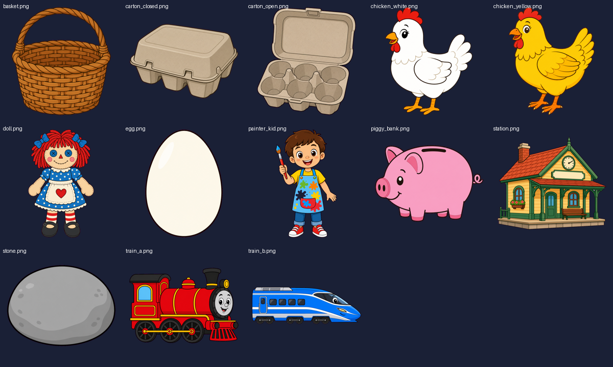

# Math Explorer

A Star Learner title that makes math **visible**. Every number is a set of things
you can count; every answer is narrated and animated; wrong answers are re-shown,
slower — never just marked wrong. Built for a six-year-old who's learning math and
finding it hard.

> **Preview.** This build ships the shell + a fully animated **Addition** tutorial.
> The full design (all four operations, practice mode, sprite-driven word problems,
> and a time-math thread) is in [`docs/STRATEGY_MATH_EXPLORER.md`](docs/STRATEGY_MATH_EXPLORER.md).
> A full review of the working set (with fresh screenshots) is in
> [`docs/REVIEW_BASIC_MATH_SET.md`](docs/REVIEW_BASIC_MATH_SET.md).


## The flow

1. **Four tabs across the bottom** — `+` Addition, `−` Subtraction, `×`
   Multiplication, `÷` Division — each a rounded, coloured square; the active one
   glows gold.
2. **Operation card** — a big symbol tile, the name, a worked example, and a gold
   **Watch the tutorial ▶** button.
3. **Addition tutorial** — `7 + 4 =` comes alive: seven red cubes are counted
   (gold ring: bright = counting now, dull = counted), then four blue cubes (grey
   ring), then we **count on** — 8, 9, 10, 11 — the heart of addition. The cubes
   turn gold and slide together into eleven. All narrated. **Tap to skip.**


## Run it

From `game/` (Godot 4.3):

```bash
# Play it on the desktop
godot --path .

# Headless tests (data integrity + every script compiles)
godot --headless --path . -s res://tests/run_tests.gd

# Regenerate the screenshots above
DISPLAY=:0 godot --path . -s res://tools/capture_shots.gd
```

## Procedural problems

Every question is **generated**, never hand-written (`MathProblemGen.gd`). A
template takes a seed and emits `{prompt, steps, answer, params, subjects}` with
fresh numbers — so a *small* art set covers *unlimited* problems, and your daughter
meets each idea in many outfits. Ten generators today: `count_add`, `take_sub`,
`groups_mul`, `share_div`, `eggs_rate`, `coins_make`, `share_dolls`, `paint_rate`,
`trains_gap`, `clock_elapsed`. Every generated answer is re-derived from `params`
in the tests, so a bad formula fails CI (1300+ checks).

One of the harder, prettier ones — **two trains**:

> Train A leaves 1 hour early at 30 mph; Train B leaves later at 50 mph. After
> 4 hours, how far ahead is Train B? → `A: (4+1)×30 = 150`, `B: 4×50 = 200`,
> **ahead = 50 miles** (and B *catches* A after 1.5 h). Animated on parallel
> tracks so you literally watch the faster train eat the gap and pull ahead.

## Story problems (built)

Two sprite-driven, narrated word-problem scenes are live, reached from the
operation card's **Story problem ▶** button (the `×` tab opens eggs, the `−` tab
opens trains):

**Two trains** (`−` tab). A red steam engine leaves first (slower); a blue bullet
leaves later (faster), visibly eats the head start, flashes **★ Caught up!** as it
passes, and pulls ahead. Freezes on `Blue − Red = miles ahead`.


**Chickens & eggs** (`×` tab). Two flavours share the `×` tab: **Watch the
tutorial ▶** plays the animated walkthrough (chickens lay, the rate equation
builds, eggs gather and fly into 6-egg cartons that **snap shut**, ending on
`total ÷ 6 = cartons`), and **Story problem ▶** is the *interactive* version she
plays (`EggsDragScene`) — drag each hen's eggs into her nest (the nest goes gold
when it holds the right number), then drag the day's eggs into cartons that snap
shut when full. Works with mouse or touch.


The animated scenes auto-play with narration and **tap-to-skip**; numbers come
from the generators (trains clamp to stay on-screen; eggs clamp to stay
countable).

## Big Kid Ideas (planned)

An unlockable track that plants **calculus / differential-equation intuitions**
(rates, accumulation, bottlenecks, equilibrium) as one-knob toys — no symbols,
just pictures that move. Includes a simplified take on the ice-cream-shop
staffing problem. Full plan and verdict in
[`docs/ADVANCED_CONCEPTS.md`](docs/ADVANCED_CONCEPTS.md).

## Assets

A cohesive **flat-vector story-sprite set** lives in `game/images/story/` — the
chickens, egg + cartons, doll + basket, piggy bank, stone, painter kid, and the
two trains + station — generated to match the console's storybook look and
magenta-keyed to transparency (`tools/key_sprite.py`). The game resolves them via
`StorySprites.gd`; math manipulatives (cubes, coins, clock, track) stay
**procedural**. A larger source library of CC0 / licensed packs sits in `assets/`
as alternates. See [`docs/ASSETS.md`](docs/ASSETS.md).



## What's built vs. planned

- **Built:** tab shell, operation card, crash-safe narrator, the counting-cube
  widget (`CubeGroup`), the Addition tutorial, the procedural problem generator
  (`MathProblemGen`, 10 templates), the story-sprite set + manifest
  (`StorySprites`), **two animated word-problem scenes** — two trains
  (`TrainsScene`) and chickens & eggs (`EggsScene`) — an **interactive drag
  activity** (`EggsDragScene`: drag eggs into nests, then into cartons), plus
  headless tests.
- **Planned (specced in the strategy doc):** Subtraction / Multiplication /
  Division tutorials, Practice mode with explained mistakes, the remaining scenes
  (coins & change, sharing dolls, painting stones), a time-math thread (clock
  face, elapsed time, rates), and the **Big Kid Ideas** track
  ([`docs/ADVANCED_CONCEPTS.md`](docs/ADVANCED_CONCEPTS.md)).

## Design notes

- **Manipulatives are procedural** (drawn, not imported): tiny APK, no texture
  spikes. Story-character art comes from CC0 packs or agent-generated flat art —
  see [`docs/ASSETS.md`](docs/ASSETS.md).
- **Narration is a baked ElevenLabs voice** (warm Matilda, same as the other
  Star Learner titles). Each sentence is a WAV in `game/audio/vo/` keyed by md5
  of its text; dynamic lines stay covered because scenes draw numbers from a
  fixed `SEED_POOL` and `tools/dump_vo_lines.gd` enumerates every possible
  sentence for `tools/gen_math_vo.py` to bake. A CI test fails if any narrated
  sentence lacks a clip. OS TTS is only a fallback, still behind the Solar
  crash fix (3.5 s warmup gate; never probe `tts_get_voices()`, which returns
  null and crashes the process on Godot 4.3).

## Layout

```
docs/                          strategy + asset plan + reviews
tools/                         gen_math_vo.py (ElevenLabs bake) / key_sprite.py
game/
  project.godot  icon.svg
  scenes/Main.tscn
  scripts/  Main / TabBar / MathTheme / MathData / Narrator / VoStream / NarratorVoice
            CubeGroup / AdditionTutorial / MathProblemGen / StorySprites
            TrainsScene / EggsScene / EggsDragScene
  audio/vo/                    baked ElevenLabs clips (md5 per sentence)
  data/math_vo_manifest.json   every sentence the narrator can speak
  tests/run_tests.gd
  tools/  capture_shots.gd / dump_vo_lines.gd
  docs/screenshots/
```
