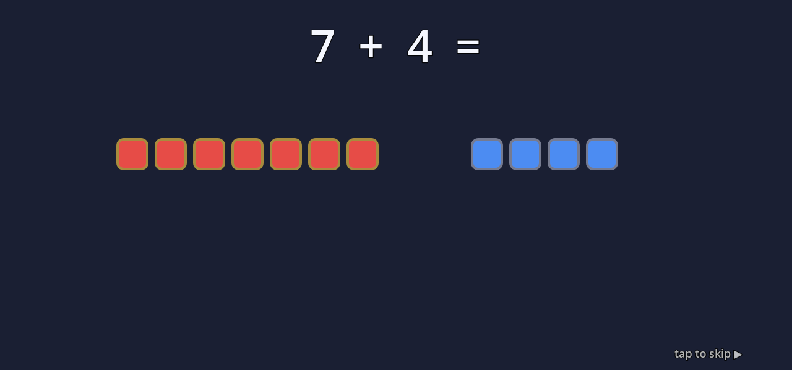
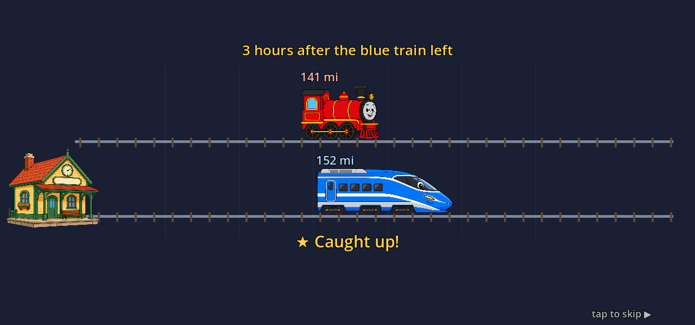
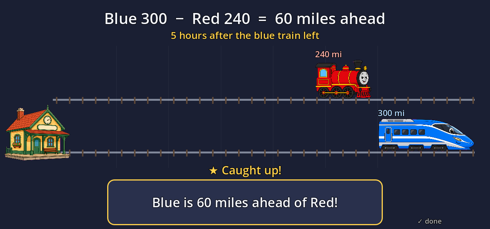
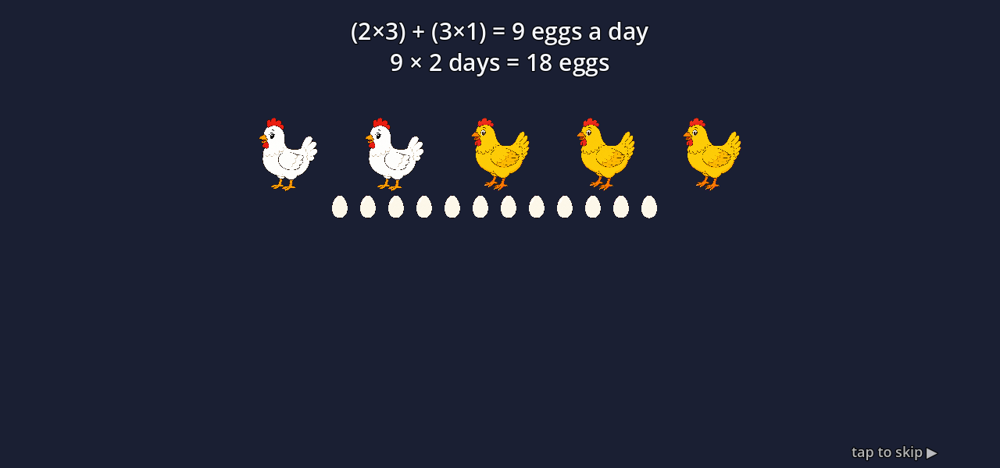
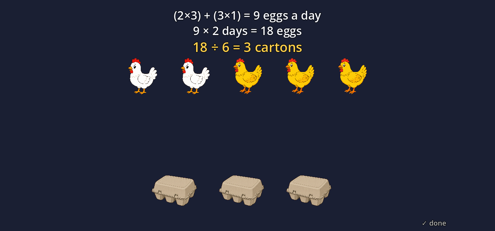
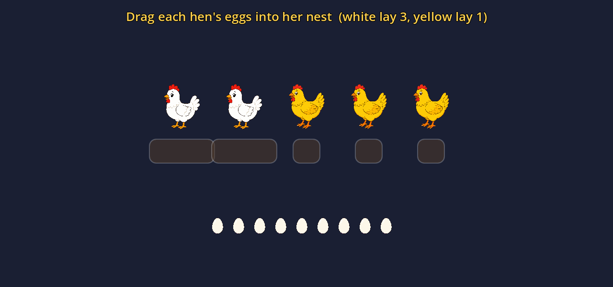
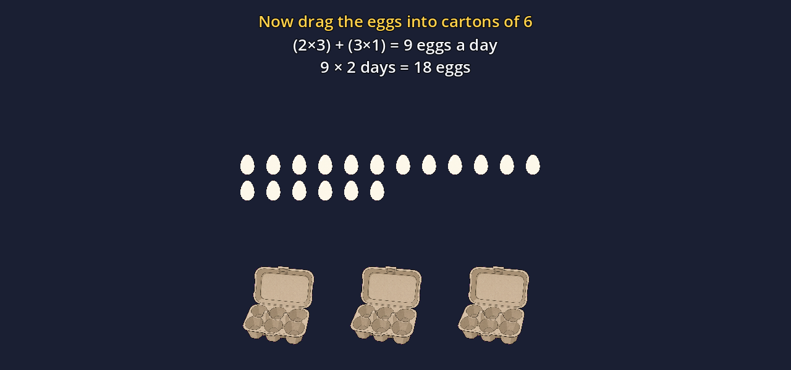

# Review: the basic math set (working state)

*Reviewed 2026-07-21 against the current build. Tests: 1,419 passing, 0 failing.
Everything below was exercised headless and on-screen; screenshots are fresh
captures from this pass (`game/tools/capture_shots.gd`).*

## What this covers

The "basic set" = the four-tab shell, the counting-cube tutorial, the ten
procedural problem generators, and the three story-problem scenes (two
animated, one interactive drag). Narration across all of it is now a **baked
ElevenLabs voice** (see [Narration](#narration-elevenlabs) below) — the same
warm Matilda narrator as Ant Explorer and Solar System Explorer.

---

## 1. The shell — four tabs, one card each

Four rounded tabs (`+ − × ÷`), active tab glows gold; each shows a hero card
with the symbol, name, worked example, and two buttons. The card layout is
consistent and legible on all four tabs.


What each button does today:

| Tab | Watch the tutorial ▶ | Story problem ▶ |
|-----|----------------------|------------------|
| `+` Addition | **Counting-on tutorial** (built) | coming soon (spoken) |
| `−` Subtraction | coming soon (spoken) | **Two trains** (built) |
| `×` Multiplication | **Chickens & eggs, animated** (built) | **Chickens & eggs, drag** (built) |
| `÷` Division | coming soon (spoken) | coming soon (spoken) |

**Verdict: solid.** The empty cells are announced honestly by the narrator
rather than dead buttons. The two biggest gaps are the `−` and `÷` tutorials
(both fully specced in `STRATEGY_MATH_EXPLORER.md`).

## 2. Addition tutorial — counting on

`7 + 4` comes alive: seven red cubes counted with the gold ring, four blue
cubes with the grey ring, then the heart of the lesson — **counting ON from
seven** (8, 9, 10, 11) — before everything turns gold and slides together.
Tap-to-skip works; Back returns to the card.




**Verdict: the pedagogy is right** — counting on is *the* addition insight, and
the ring language (bright = counting now, dull = counted) reads instantly.
One nit: the tutorial is always 7 + 4. The `count_add` generator already
produces varied pairs, and the VO now has clips baked for eight (a, b) pairs —
wiring variety in is a small change.

## 3. Procedural generators — the problem engine

All ten templates generate correctly across every seed tested; the test suite
recomputes each answer from `params` independently, so a wrong formula cannot
slip through. Real output from this pass:

| Template | Sample (seed 0) | Answer |
|----------|-----------------|--------|
| `count_add` | 9 purple cubes and 7 more. How many in all? | 16 |
| `take_sub` | There are 6 cubes. Take away 4. How many are left? | 2 |
| `groups_mul` | 5 groups of 5 cubes. How many altogether? | 25 |
| `share_div` | Share 20 cubes fairly into 4 buckets. How many in each? | 5 |
| `eggs_rate` | 5 white chickens lay 3 eggs a day, 5 yellow lay 1… 2 days? cartons? | 40 |
| `coins_make` | 1 dime, 4 nickels, 8 pennies — how many ways to make 20¢? | 4 |
| `share_dolls` | Basket has 5 dolls; kids add 1 and 3; 2 kids share. How many each? | 4 |
| `paint_rate` | Ben paints 5 stones an hour, Max paints 5. 20 stones. Hours? | 2 |
| `trains_gap` | A leaves 1 h early at 40 mph; B later at 70 mph. After 5 h, gap? | 110 |
| `clock_elapsed` | It is 4 o'clock. In 1 hour, what time will it be? | 5 |

Fixed during this review: two grammar bugs surfaced by the dump —
*"lay 1 egg**s** a day"* and *"1 dime**s**"* now pluralize correctly.

**Verdict: healthy.** Percentages aren't in the set yet (noted as a future
template family alongside rates); `trains_gap` and `paint_rate` already carry
the rate-thinking thread.

## 4. Two trains (`−` story) — rate × time made visible

The red steam engine leaves first, slower; the blue bullet leaves later,
visibly eats the head start, flashes **★ Caught up!**, and pulls ahead. The
sim freezes at the asked hour on `Blue − Red = miles ahead`.




Fixed during this review: the **★ Caught up!** banner used to overlap the hour
caption and the mile labels; it now sits centered in the clear band under the
rails.

**Verdict: the strongest scene.** Watching the faster train eat the gap *is*
the insight, and the freeze-frame equation lands it. Numbers now come from a
fixed ten-seed pool (so all narration is baked) — still ten genuinely
different problems per visit.

## 5. Chickens & eggs, animated (`×` tutorial)

Chickens lay, the rate equation builds term by term, eggs gather, then fly
into 6-egg cartons that snap shut. Ends on the three worked equations.




**Verdict: good chain of reasoning** — (rate × count) + (rate × count), then
× days, then ÷ carton size: three operations in one story without feeling like
three problems. The skip path (tap) correctly jumps to the finished layout.

## 6. Chickens & eggs, interactive drag (`×` story)

She plays it: drag eggs from the pile into each hen's nest (a nest locks with
a **gold outline** at the right count and rejects extras), then the day's eggs
multiply and she packs them into cartons that snap shut when full. Mouse and
touch both work; misdropped eggs snap home.




**Verdict: works, one design note.** In the lay phase the instruction states
the counts ("white lay 2, yellow lay 2"), so filling nests is *following*, not
*figuring out*. A future version could show the counts as pictures over one
example hen and let her infer the rest — closer to real problem-solving.

## Narration: ElevenLabs

All narration now plays a **baked ElevenLabs voice** instead of OS TTS:

- `Narrator.gd` (ported from Solar System Explorer) hashes each spoken sentence
  (md5 of normalized text) and plays `game/audio/vo/<md5>.wav`; OS TTS remains
  only as a fallback for a missing clip.
- Dynamic lines are fully covered because each scene draws its numbers from a
  fixed `SEED_POOL` (10 seeds each) and exposes `vo_lines(seed)`, a pure
  function of the seed. `game/tools/dump_vo_lines.gd` enumerates every possible
  sentence → `data/math_vo_manifest.json` → `tools/gen_math_vo.py` bakes them.
- **132 sentences (~3.5K characters) baked** this pass with the shared family
  key (warm Matilda voice, same knobs as the other titles).
- A new test walks every scene's full line set and fails if any sentence lacks
  a clip — so editing narration text without re-baking breaks CI, not the game.

Re-bake after changing any narrated string:

```bash
cd math_explorer/game && godot --headless --path . -s res://tools/dump_vo_lines.gd
cd .. && ./tools/gen_math_vo.py
```

## Priorities suggested by this review

1. **Subtraction tutorial** (take-away with the cube widget) — it's the only
   tab where both buttons still say "coming soon" *and* the concept is
   foundational. The spec exists; the `CubeGroup` widget already supports it.
2. **Division tutorial** (sharing into buckets, with remainder) — `share_div`
   already generates the numbers.
3. **Vary the addition tutorial's numbers** — VO for eight pairs is baked.
4. Story problems for `+` (coins) and `÷` (sharing dolls) — sprites exist.
5. Then the **Big Kid Ideas** track (`ADVANCED_CONCEPTS.md`), starting with
   Filling the Tub.
