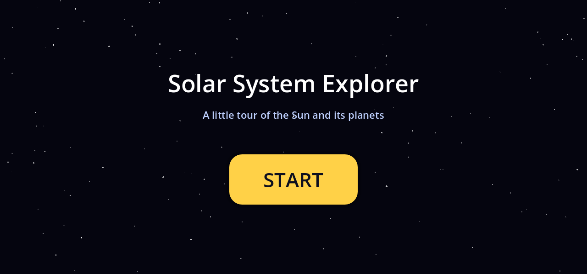
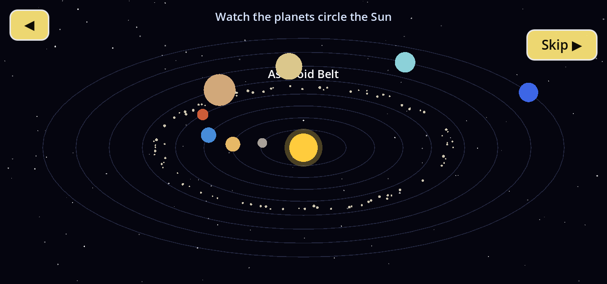
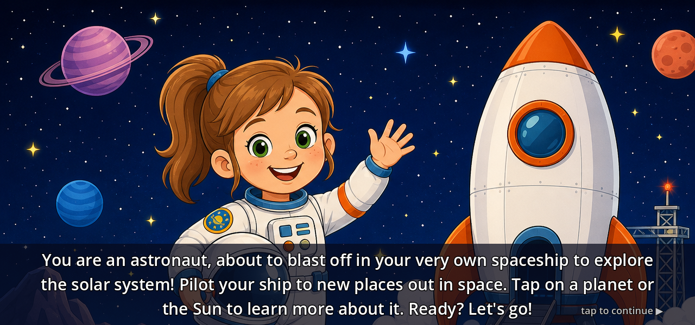
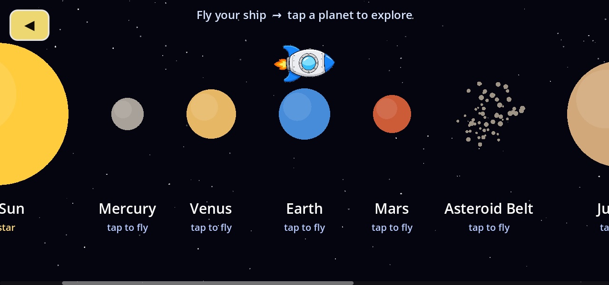
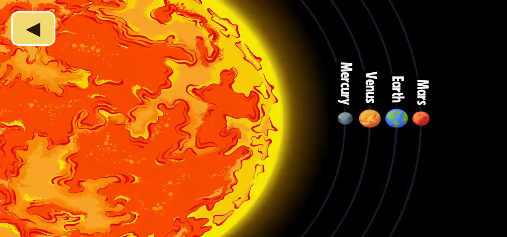

# Solar System Explorer (preview)

**Game #2 in the [Star Learner](../README.md) catalog** — a deliberately tiny *preview* title whose
job is to prove the console holds more than one subject. A calm, guided tour of the Sun and its
planets for a young child. Marked **PREVIEW** on every screen.

- **Engine:** Godot **4.3** (Mobile renderer), landscape 1280×600, offline-first.
- **Assets:** bodies + orbits drawn procedurally; narration is the OS text-to-speech voice. Two
  image assets in `game/images/` — the astronaut girl and the ship marker. Each body has a **real
  1–2 minute `.ogv` clip** in `game/videos/` (see below).
- **Package (planned):** `com.dylan.antexplorer.solar` · tile `tile_solar` · label **planets**.

## The flow

1. **Title → START.** A star-field title screen with one big START button.
2. **Orrery (top-down).** The Sun with the eight planets tracing flattened ellipses, plus the
   **asteroid belt** as a scattered ring between Mars and Jupiter. A voice walks the tour
   (Mercury → Mars → asteroid belt → Jupiter → Neptune) naming a couple of facts, highlighting the
   one it's on. A **Skip ▶** jumps ahead; **◀** returns home.
3. **Astronaut briefing.** A cartoon astronaut girl (helmet under one arm, waving) in front of her
   spaceship, with a spoken *"you are an astronaut…"* briefing. The overlay fades out to reveal the
   piloting strip underneath — so it reads as changing into the fly screen. **Tap to skip.**
4. **Piloting strip.** A horizontal, drag-to-scroll row of the Sun, all eight planets, the
   **asteroid belt** (a rock cluster in place between Mars and Jupiter), **and Pluto** (*"not a
   planet anymore"*). A **spaceship marker** hovers above the selected body (starts over Earth).
   Tapping another body **flies the ship there** with a speed-up / slow-down glide (nose turns to
   face the way it's going), then opens that body's video on arrival.
5. **Body video.** Plays the body's `res://videos/<id>.ogv` clip. Big **◀** Back; the clip
   auto-closes when it finishes. If a clip is ever missing it falls back to a spoken **"video coming
   soon"** facts card, so the app never dead-ends.







## Run & test

```bash
cd game
godot --path .                                            # play (needs a display)
godot --headless --path . -s res://tests/run_tests.gd     # logic tests (data + layout + compile)
DISPLAY=:1 godot --path . -s res://tools/capture_preview_shots.gd   # regenerate screenshots
DISPLAY=:1 godot --path . -s res://tools/make_tile.gd              # regenerate the launcher tile
```

`tests/run_tests.gd` also force-loads every view script, so a compile error anywhere fails the run
(headless can't render the scenes themselves).

## The 1–2 minute videos (ingested)

Built with the same shape as Ant Explorer's `build_stars.sh`: a TSV manifest
([`tools/solar_bodies.tsv`](tools/solar_bodies.tsv), columns `id / start / end / url`) fed to
[`tools/build_clips.sh`](tools/build_clips.sh), which `yt-dlp`-downloads the source once (cached
under `tools/build/sources/`) and `ffmpeg`-cuts one Theora `.ogv` per body into `game/videos/<id>.ogv`.
IDs match [`game/scripts/SolarData.gd`](game/scripts/SolarData.gd) (`sun` … `asteroid_belt` … `pluto`).

```bash
tools/build_clips.sh                 # all bodies → game/videos/<id>.ogv
tools/build_clips.sh --id saturn     # re-cut one (source stays cached)
tools/build_clips.sh --force         # rebuild everything
```

**Source:** the windows are the creator's own chapter markers on a single tour video —
*"The Solar System Explained (2026)"* by **VectorGlobe / @KnowtheWorld**
(`youtube.com/watch?v=1wyr5rWonbE`). Kid-clean narrated animation; used for the **private family
device**, the same posture as Ant Explorer's clips. Credit the channel; swap in public-domain
**NASA** footage if this ever ships beyond the gift. Clip lengths track the source beats: planets
run ~55–77 s each; the asteroid belt is a short ~14 s beat (all the on-point footage the source
gives it); Pluto rides the ~27 s Kuiper-belt / dwarf-planet segment.

**Note:** the eleven clips total ~165 MB. That bakes into the game APK; if you'd rather keep the APK
small, lower `libtheora -q:v` in `build_clips.sh`, or push `game/videos/` to the device out-of-band
(`adb push`) instead of embedding.

**Ingest prerequisite:** modern YouTube needs a JS runtime for `yt-dlp`'s challenge solver. Install
[Deno](https://deno.land) user-local (`curl -fsSL https://deno.land/install.sh | sh`) and ensure
`~/.deno/bin` is on `PATH`; the `.ogv` cutting itself only needs `ffmpeg` (with `libtheora` +
`libvorbis`).

## Shipping it to the Star Learner unit

The device work mirrors Ant Explorer (see `../ant_explorer/docs/STRATEGY_ANT_PHONE_UPDATES.md`):

1. Install the Godot **Android build template** into `game/` once (editor: *Project → Install
   Android Build Template*), then build/sign with [`tools/build_solar_apk.sh`](tools/build_solar_apk.sh)
   (produces `com.dylan.antexplorer.solar.apk`).
2. The launcher is already wired: a **planets** tile (`tile_solar`) and a catalog entry were added to
   `ant_explorer/kiosk_placeholder` (baked `assets/catalog.json`) and to the deploy staging copy
   `ant_explorer/tools/catalog.json`. Rebuilding the launcher APK shows two tiles; until the game
   APK lands, the tile toasts *"not installed yet"* (kid-safe).
3. `adb install -r com.dylan.antexplorer.solar.apk` + push the updated `catalog.json` — done.

## Status / honesty

This is a **preview**, on purpose:

- Orrery narration is live OS TTS, not the warm baked ElevenLabs voice the ants use.
- Sizes and orbits are **not to scale** — chosen to read for a six-year-old, not for accuracy.
- The clips are third-party YouTube footage cut for the private family device; re-source from
  public-domain NASA before any wider distribution.

What it *does* prove: a second, different-subject title boots into the same landscape shell, uses
the same video mechanic (real cut-and-transcoded `.ogv` clips, Sun through Pluto plus the asteroid
belt), and appears as its own tile on the console — the multi-game claim, made concrete.
