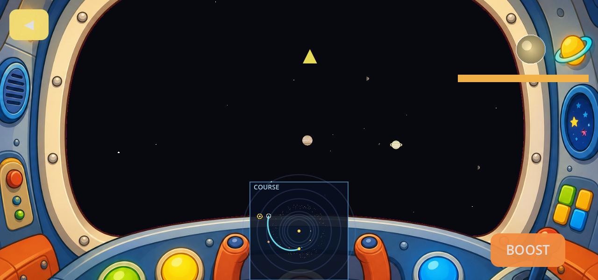
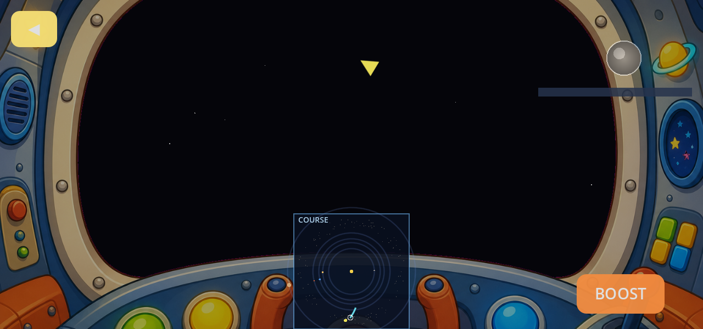

# STRATEGY — Flight Dynamics & Proximity (navigation refinement pass)

*Refinement brief for the 3D flyer's cruise loop: a real burn simulation (accelerate → coast →
flip-and-decelerate), a camera that always faces the direction of travel, recognizable planet
icons that bloom into rendered worlds only on true proximity, a graceful tangential orbit entry,
and an asteroid belt that is invisible until you're inside it — with named major asteroids to
visit. Companion to [`STRATEGY_3D_FLYER.md`](STRATEGY_3D_FLYER.md) (engine plumbing) and
[`STRATEGY_SOLAR_SYSTEM_NAVIGATION_EXPERIENCE.md`](STRATEGY_SOLAR_SYSTEM_NAVIGATION_EXPERIENCE.md)
(the honesty contract, which this pass inherits unchanged: **every spoken claim is derived from
the actual course geometry**).*

---

## 0. Evidence — six charted courses, screenshotted

Before designing anything, the standing trip harness was extended (Earth → Asteroid Belt and
Earth → Saturn added to `tools/capture_trips.gd`) and run:

```
DISPLAY=:1 godot --path game -s res://tools/capture_trips.gd     # shots + geometry checks
godot --headless --path game -s res://tools/probe_trip_timing.gd # timing numbers (new probe)
```

Shots land in `game/docs/screenshots/trips/`. All 30 honesty checks pass — the *claims* are
sound. The *feel* is where the problems live. Measured timing with the shipped knobs
(`cruise_speed = 11`, hop clamp `[12, 40] s`, `game_year_seconds = 30`):

| Trip | path len (u) | flown duration | orbital `t_arr` | clamp gap | dest. sweep during hop |
|---|---:|---:|---:|---:|---:|
| Earth → Mercury | 114.2 | 12.0 s | 11.5 s | +0.5 s | **573.8°** (laps the Sun 1.6×) |
| Earth → Mars | 142.6 | 13.0 s | 13.3 s | −0.4 s | 85.0° |
| Earth → Asteroid Belt | 28.1 | 12.0 s | 3.5 s | **+8.5 s** | 9.2° |
| Earth → Jupiter | 167.1 | 15.2 s | 15.9 s | −0.7 s | 16.1° |
| Earth → Saturn | 238.4 | 21.7 s | 22.5 s | −0.9 s | 9.2° |
| Earth → Neptune | 368.9 | 33.5 s | 35.0 s | −1.4 s | **2.5°** |
| Jupiter → Mars | 42.2 | 12.0 s | 5.4 s | **+6.6 s** | 34.3° |

What the numbers and frames say, mapped to the five asks:

1. **Speed.** The cubic ease-in-out reaches half of peak speed almost immediately on short hops,
   and the 12 s floor stretches short trips (belt, Jupiter → Mars) so the orbital clock runs at
   0.3–0.45× true rate while flying — the charted intercept and the flown sky disagree. Outer
   destinations barely move (Neptune 2.5°); Mercury comically laps the Sun. There is no
   acceleration *story* — no burn, no coast, no braking.
2. **Camera.** `_aim_camera` blends the look direction from path-forward toward the destination
   over the back 65% of the hop, and `apparent_size` lets *any* nearby body overshoot to
   1.25× hero size. Net effect in `earth_to_saturn_1_fly_u040.png`: the Sun balloons to half the
   canopy mid-cruise and passing worlds swell — it *reads* as the camera rubber-necking even
   though it technically never targets them.
3. **En-route planets.** Non-destination worlds are anonymous white dots
   (`earth_to_neptune_1_fly_u040.png` is a black window with a faint dot line). Nothing is
   recognizable, and when a dot crosses the mesh-LOD line it pops into a full sphere.
4. **Arrival.** `_place_orbit_cam` does `look_at(planet center)` — the planet is dead-center and
   the camera circles it like a museum exhibit (`earth_to_jupiter_2_orbit.png`), not "flying an
   orbit." The system clock keeps running at 1× while parked.
5. **Belt.** The belt is a *single sphere with a noise skin* as a destination — arrival orbits a
   giant static-noise ball (`earth_to_asteroid_belt_2_orbit.png`). The rock field is visible from
   everywhere as a white dotted line across the sky. Narration says *"out to Asteroid Belt …
   Asteroid Belt is moving, so we aim ahead of it!"* — grammatically off and conceptually wrong
   (a ring isn't a point you lead).




---

## 1. Burn simulation — accelerate, coast, flip, brake

### 1.1 The model

Replace the cubic ease with a **trapezoidal velocity profile** — the honest cartoon of a real
constant-thrust transfer (fuel-free, speeds absurdly high, exactly as briefed):

```
        v ▲        ______________
          │       /              \
          │      / burn    coast  \  flip-and-brake
          │     /                  \
          └────┴────────────────────┴─────▶ t
```

- `a_burn` (u/s²) and `v_max` (u/s) are the only knobs.
- Distance `d` = baked path length. If `d ≥ v_max²/a_burn` the profile is a trapezoid
  (`T = d/v_max + v_max/a_burn`); shorter hops go **triangular** — the ship never reaches cruise,
  peak speed is `√(d·a_burn)` (`T = 2·√(d/a_burn)`). Both cases have closed-form `s(t)`, so the
  driver stays a pure function: `progress = s(t)/d`. Headless-testable like `ease_cubic_inout`.
- **No duration clamp.** `T` *is* the trip time; the design band becomes a `ScaleTune` assertion
  on the knob choice, not a runtime lie. This kills the clamp gap: the orbital clock and the
  flown seconds become the same number (`t_arr ≡ duration`), fixing the 0.3× slow-motion sky on
  short hops for free.
- The **intercept solve** swaps `distance/cruise` for `travel_time(distance)` in the fixed-point
  loop — same 3–4 iterations, same convergence behavior (the profile is monotonic in `d`).

### 1.2 Starting numbers (tuning-pass seeds)

`a_burn = 1.1 u/s²`, `v_max = 17 u/s`, `game_year_seconds 30 → 45`.

| Trip | profile | T | peak v | dest. sweep |
|---|---|---:|---:|---:|
| Earth → Mercury | triangular | 20.4 s | 11.2 | ~1.3 laps → see §1.4 |
| Earth → Mars | triangular | 22.8 s | 12.5 | ~97° |
| Earth → Jupiter | triangular | 24.7 s | 13.6 | ~17° |
| Earth → Saturn | triangular | 29.4 s | 16.2 | ~9° |
| Earth → Neptune | trapezoid | 37.2 s | 17.0 | ~2° |
| Jupiter → Mars | triangular | 12.4 s | 6.8 | ~53° |

Why these: at 1.1 u/s² the ship is only doing ~3 u/s three seconds after launch — the origin
planet visibly recedes behind you (the departure *story*). Peak speeds land near the old cruise
for mid hops, so the dot-streaming middle keeps its energy. The brake leg is symmetric, so the
final third of every hop is a long, calm deceleration into the bloom — which is exactly where
the arrival choreography (§4) takes over. Band is ~12–37 s: same envelope as today, but now it
*emerges from physics* instead of a clamp.

### 1.3 What the kid sees and hears

The chart already teaches "aim ahead." The burn teaches "ships don't have brakes in space —
they turn around and burn." Sell it cheaply:

- **HUD**: the existing distance bar gains a tiny three-phase tint (burn amber → coast green →
  brake amber). No numbers.
- **Narration** (baked, chosen from measured profile, honesty rule): *"Engines on — hold tight,
  we're speeding up!"* at launch; on trapezoid hops, one mid-line *"Cruising speed!"*; at the
  flip, *"Halfway — time to turn around and slow down!"* The flip line only plays when the
  profile really has a brake leg starting (always true), and the cruise line only on true
  trapezoids.
- **BOOST** stays a time nudge — it never breaks the profile.

### 1.4 The Mercury problem (and why it's a feature)

At `game_year_seconds = 45`, Mercury's period is 10.8 s; a ~20 s trip still laps it. Don't hide
it — it's the best "fast inner planet" lesson in the game, *if narrated*: when the intercept
solve's sweep exceeds 360°, add the (geometry-derived, hence honest) line *"Mercury is so quick
it will zoom all the way around the Sun before we get there!"* The plot board's ghost already
shows the arrival spot; the lead line just looks dramatic. Outer planets stay nearly still
during a hop — that is *truthful* (they're slow); their aim-ahead lesson lives on the board's
fast-forward beat, which stays as-is.

---

## 2. Camera — always face the velocity vector

- **Delete the destination look-blend.** The camera looks strictly down the path tangent
  (`PathFollow3D.ROTATION_ORIENTED` already provides it). Because the course *ends at the
  intercept point*, the destination slides naturally to center in the final leg without any
  stare logic — the geometry does the framing.
- Keep the gentle curvature roll; drop the sine-roll tied to look-blend weight.
- **Cap `apparent_size` at 1.0× hero** (today 1.25×). Passing worlds may still grow by genuine
  proximity (§3) — but they grow *in the window edge and slide by*, never inflate center-frame.
- Orbit mode gets its own forward-facing rule in §4.

One honest concession to the daughter who "may like it": a passing world that triggers the
proximity render (§3) also gets a brief gold outline ping on the console map — attention without
camera theft.

**Test contract:** during cruise, `angle(camera forward, path tangent) < 0.5°` every frame — a
headless sweep over sampled `u`, all six harness trips.

---

## 3. En-route planets — icons, proximity blooms, and collision-free courses

### 3.1 Pixel AR marker icons (not photoreal discs)

Far bodies render as **chunky 2D AR pins** — intentionally pixelated billboards with corner
brackets, not SubViewport samples of the 3D skin (those read as nearby planets). Baked once by
`tools/gen_marker_icons.py` into `game/images/markers/<id>.png` (64×64); `PlanetSkins.make_icon_texture`
loads those first.

**Relative marker size** tracks the ScrollView strip (`draw_radius / 54`, Earth = 1.0), so Jupiter
reads clearly larger than Earth / Mercury the same way kids saw on the selection flyover.
Icons keep **constant screen size** (`pixel_size` × camera distance) so they stay findable map
pins until handoff.

QA: `./qa/run_marker_lod_suite.sh` (every flyer body — far pin / handoff swap / near mesh).

### 3.2 Apparent-size handoff (pin → 3D)

Handoff is driven by **apparent size**, not a fixed world-radius threshold:

```
handoff_dist = OrbitMath.flyby_handoff_dist(hero_r, icon_tier, cfg)
# mesh replaces pin slightly early (FLYBY_HANDOFF_EARLY ≈ 0.92)
# first mesh scale ≈ marker world width at that distance
```

- Beyond handoff: pixel AR pin only.
- At / just inside handoff: pin hides, 3D mesh appears at ~marker angular size, then grows with
  the flyby apparent-size curve (clearance-capped).
- Destination always eligible for mesh; Sun stays pin unless it *is* the destination.
- A flyby world "may hardly be in view" — fine; console ping (§2) + narrated flyby (§3.4) carry it.

### 3.3 Collision avoidance without moving planets — the method, reasoned out

**Why not steer dynamically (potential fields / autopilot dodge)?** Because the charted course
is a *promise*. If the ship swerves in flight, the board lied. Rejected.

**Why not just widen the Bézier bow?** The bow is a Sun-avoidance heuristic; it knows nothing
about where planets will be *when the ship gets there*. Rejected as the general fix (kept as the
seed shape).

**Chosen: plot-time sweep + smooth lateral deflection.** Everything is deterministic — the burn
profile gives ship position `s(t)` on the curve, and `body_pos(b, t)` gives every world's
position at every second. So at plot time:

1. **Sweep**: sample the hop (~100 steps, refine around minima) and record each body's minimum
   separation from the ship *at the same clock* — a true moving-target sweep, not a static
   line-vs-circle test.
2. **Classify** per body with `clear_i = 2.2 · hero_r_i + 2` (safely outside the largest
   rendered size):
   - `min_sep < clear_i` → **conflict**: deflect (step 3).
   - `clear_i ≤ min_sep < 7 · hero_r_i` → **flyby**: no deflection needed; this is the honest
     "trajectory truly takes the ship close" trigger for the proximity render + narration.
   - else → ignore.
3. **Deflect**: add a smooth lateral bump to the curve, centered at the closest-approach
   parameter `u_cpa`: direction = the in-plane perpendicular of the relative vector at CPA,
   side chosen to need the *least* deflection while preferring the Sun-away side; magnitude
   `clear_i − min_sep + pad`; profile a `cos²` window over `u ∈ [u_cpa − w, u_cpa + w]`
   (`w ≈ 0.12`). Displace the sampled points, rebuild the `Curve3D`.
4. **Re-time and re-verify**: path length changed → recompute `T` from the profile, re-run the
   sweep (a deflection can graze a new body; the field is sparse, ≤ 3 iterations always settles
   in practice — assert it). The Sun joins the sweep with `clear = sun_approach_standoff`,
   subsuming today's bow heuristic as just another body.

Because deflection happens **at plot time**, the board draws the swerve, the console map shows
it, the narration can claim it, and the flight flies it. Chart = flight = words. Planets never
move; the *course* respects them.

### 3.4 Slingshots — the deflection's fun twin

When the sweep finds a **conflict or near-conflict** with a big world (`hero_r ≥ 6`: Jupiter,
Saturn — the bodies where a gravity assist makes sense), don't route timidly around it — **snap
the course to skim the clearance sphere** on the exit-favorable side and grant a post-CPA boost:
`v_max × 1.3` for the remainder of the hop (re-timed up front, so the charted `T` already
includes it). The board draws the tight swing; narration (baked variants, geometry-gated):

> *"We'll slingshot around Jupiter — its gravity gives us a speed boost!"*

The honesty rule holds: the slingshot line only plays when the final curve's measured CPA to
that body is within the skim window, and the boost is visible in the HUD phase tint. This is the
"realistic burn except faster and free" fantasy meeting real orbital mechanics vocabulary —
exactly the teachable moment the brief asks for.

---

## 4. Arrival — tangential orbit entry, planet abeam, system at rest

Today the ship peels off at standoff and the camera snaps to `look_at(center)`. Replace with:

1. **Entry arc.** During the brake leg's final stretch (ship within ~2.2× standoff), blend the
   remaining path into a spline that meets the parking circle (`orbit_standoff(hero_r)`)
   **tangentially** — velocity direction is continuous through entry (assert: heading change
   < 4°/frame across the seam). The sunlit-side bias stays: the tangent point is chosen so the
   parked arc opens over the day side.
2. **Forward-facing orbit camera.** In orbit the camera looks along the **orbit tangent** (the
   direction of travel), yawed a fixed `~35°` toward the planet — with the 1280×600 canopy's
   ~107° horizontal FOV that parks the planet around the left or right third of the glass,
   filling it, while the stars stream past ahead. Side (left vs right) falls out of the entry
   geometry — whichever side the ship arrived on, keep it; no snap.
3. **The system rests.** Ramp the orbital clock to `orbit_time_scale ≈ 0.1` over ~2 s (slow,
   alive, effectively parked — narration happens over a still sky, per the "silence beats
   filler" rule). Restore 1× on the next chart.
4. **Icons stay up.** All non-destination bodies keep their §3.1 icons while orbiting, so as the
   camera pans, the whole solar system is *findable* from orbit — Saturn's little ringed marker
   hanging in the black is the invitation for the next hop.

---

## 5. Asteroid belt — invisible until you're in it, with named worlds to visit

### 5.1 Rocks: proximity-only

The 280-rock MultiMesh stays (one draw call) but gains a distance fade in its material
(vertex-distance → alpha): fully invisible beyond `belt_fade_far = 70 u` from the camera, full
presence inside `belt_fade_near = 35 u`. The white dotted line across the sky from three orbits
away — gone. Flying *through* the belt becomes a reveal: black window, then rocks resolve around
you. Extra cheap win: skip the MultiMesh entirely when the ship is > 120 u from the belt ring.

### 5.2 The belt sphere dies; major asteroids are born

`asteroid_belt` stops being a rendered destination body (no more noise ball). Instead add three
real, nameable worlds to `SolarData` (real `a_au`, tiny hero radii, own skins/icons/facts):

| Id | Name | a (AU) | Hook | Live footage source |
|---|---|---:|---|---|
| `ceres` | Ceres | 2.77 | a *dwarf planet* inside the belt; bright spots | Dawn (NASA) |
| `vesta` | Vesta | 2.36 | second-biggest; a mountain twice Everest | Dawn (NASA) |
| `psyche` | Psyche | 2.92 | a metal world; a spacecraft is on its way now | Psyche mission renders |

(Ceres and Vesta have genuine mission imagery via Dawn; Psyche trades imagery for a
"happening right now" story. If sourcing disappoints, Pallas/Hygiea are the fallbacks.)

### 5.3 The flow the brief asks for

```
Player taps "Asteroid Belt"
  → game resolves it to the NEAREST major asteroid (by current angular position at t0)
  → PlotBoard charts an honest course to that asteroid   ("The belt is a wide ring of space
     rocks between Mars and Jupiter. We'll visit Ceres — the biggest one!")
  → cruise: black, then the rock field fades in around the ship (§5.1), the asteroid blooms
  → tangential orbit entry (§4) around the asteroid
  → Learn more → that asteroid's live clip plays (videos/ceres.ogv …)
  → then the asteroid-belt explainer (videos/asteroid_belt.ogv) auto-queues
```

Tapping a specific asteroid (they appear on the plot board inside the belt ring) charts to it
directly. The two-clip chain respects the one-decoder `VideoPanel` contract — strictly
sequential, back button skips the rest of the chain. Clips are cut exactly like every other
body: rows in `tools/solar_bodies.tsv` → `tools/build_clips.sh` → `game/videos/<id>.ogv`
(the belt explainer beat already exists; the Dawn opener footage is already in the source
cache).

Narration fixes ride along: *"out to **the** Asteroid Belt"*, and the "aim ahead" line applies
to the asteroid (a real moving point), not the ring.

---

## 6. The balance, in one table

All new knobs live in `SolarFlyerConfig` (JSON-overridable on device, as ever):

| Knob | Seed | What it balances |
|---|---:|---|
| `burn_accel` | 1.1 u/s² | departure readability vs. impatience |
| `v_max` | 17 u/s | mid-cruise energy vs. "too fast, planet hardly moves" |
| `game_year_seconds` | 45 | Mercury dizziness vs. dead outer sky |
| `render_in_k` (× hero_r, clamp 40–140) | 14 | when a flyby world blooms from its icon |
| icon tiers | 1.0 / 1.3 / 1.7 / 2.0 | recognizable ≠ to-scale (Jupiter ≈ 2× Earth) |
| `clearance_k` (× hero_r, + 2) | 2.2 | collision-free honesty margin |
| slingshot skim window | < 7 × hero_r, big worlds only | how eagerly courses turn flybys into assists |
| `slingshot_boost` | 1.3 × v_max | the reward for the swing |
| `orbit_time_scale` | 0.1 | parked calm vs. dead-frozen sky |
| `belt_fade_near/far` | 35 / 70 u | belt reveal drama vs. sky clutter |
| orbit camera yaw toward planet | ~35° | planet abeam vs. planet centered |

**Moto G Play 2024 budget** (Snapdragon 680 / Adreno 610, the binding constraint): icons are
~10 static billboards (replacing the dot billboards 1:1 — net zero); at most 2–3 proximity
meshes alive at once (destination + a flyby + the Sun) vs. today's unbounded hysteresis;
the belt fade is a vertex-shader alpha on the existing single MultiMesh; the plot-time sweep is
~100 × 10 distance checks *once per chart* (microseconds, not per-frame); orbit `time_scale`
0.1 *reduces* per-frame work while parked. Nothing here adds a light, a shadow, or a draw call.
The one watch-item is icon bake at load (10 tiny SubViewport renders — do them across frames
behind the title screen).

---

## 7. Verification — extend the harness, keep the honesty loop

- `tools/capture_trips.gd` (already extended to 6 trips this pass) gains: a slingshot trip
  (pick an epoch where Earth → Saturn skims Jupiter), an Earth → Asteroid Belt run asserting the
  resolved asteroid id, and per-frame camera-tangent checks during the capture flight.
- `tools/probe_trip_timing.gd` (new this pass) is the timing dashboard: rerun after every knob
  change; the table in §0 is the "before."
- New headless contracts in `run_tests.gd` / `ScaleTune.evaluate`:
  1. Burn profile: `s(0)=0`, `s(T)=d`, `v(0)=v(T)=0`, `s` strictly monotonic; triangular ↔
     trapezoid threshold exact.
  2. `duration == t_arr` for every pair — the clamp gap is dead, by construction.
  3. Intercept convergence with the profile, including the Mercury lapping case; lap narration
     fires iff sweep > 360°.
  4. **No-collision sweep**: for all ordered pairs × 8 epochs, final course min separation ≥
     clearance for every body. Deflection settles in ≤ 3 iterations.
  5. Slingshot narration iff measured CPA inside the skim window (same proof pattern as the
     Sun-flyby line).
  6. Cruise camera: forward within 0.5° of path tangent at all sampled `u`.
  7. Orbit entry: heading continuity through the seam; planet bearing ≈ 35° ± 5; clock at
     `orbit_time_scale` while parked.
  8. Icon tiers monotonic vs `real_radius_km`; giant tier = 2.0 × small.
  9. Belt: rock alpha 0 beyond `belt_fade_far`; belt tap resolves to the nearest major asteroid;
     video chain order asteroid → belt.
  10. VO completeness: every new sentence (burn beats, lap line, slingshot lines, asteroid trip/
      arrival lines with their AU/mile figures) enumerated by `dump_vo_lines.gd` and baked —
      the existing "no unbaked sentence" test covers it once the lines are registered.

---

## 8. Phasing (each shippable, each screenshot-verified)

1. **Burn core.** Profile math + intercept swap + clamp removal + retimed knobs
   (`burn_accel`, `v_max`, `game_year_seconds`). Rerun probe → new §0 table. VO: burn beats.
2. **Camera + icons.** Tangent-lock camera, apparent-size cap, icon bake + tiers, per-body
   `render_in` crossfade replacing global LOD hysteresis.
3. **Sweep + deflection + slingshot.** Plot-time collision method (§3.3), skim-and-boost (§3.4),
   board/console draw the final curve, new narration gated on measured geometry. VO bake.
4. **Orbit entry.** Tangential entry spline, abeam forward-facing orbit camera, system rest,
   icons-in-orbit.
5. **Belt.** Ceres/Vesta/Psyche data + skins + facts + clips (`solar_bodies.tsv` rows,
   `build_clips.sh`), belt-tap resolution, rock fade shader, two-clip chain, narration grammar
   fix.
6. **Device pass.** Push knobs via `/sdcard/AntPhone/solar_flyer.json`, tune on the Moto G Play
   against the §6 table, re-capture all trips, update `STRATEGY_SOLAR_SYSTEM_NAVIGATION_
   EXPERIENCE.md` §5 with the final numbers.

---

## 9. Implementation status (July 2026)

Phases 1–5 are **implemented and verified**; phase 6 (on-device tune) remains.

- **Burn profile** (§2): trapezoid/triangular in `OrbitMath.burn_*`; `duration == t_arr`
  asserted for every destination. HUD bar tints amber/green/blue by phase; launch/cruise/flip
  beats spoken.
- **Camera + icons** (§3): tangent-locked cruise camera (harness asserts < 6° off-tangent at
  every sampled frame), tiered icon billboards with ring silhouettes, per-body `render_in`
  crossfade — the mesh appears at the icon's exact world size and grows by proximity.
- **Sweep / deflection / slingshot** (§3.3–3.4): plot-time refinement with launch windows for
  undodgeable inner-world conjunctions; slingshot skim-and-boost with narration gated on
  measured CPA. Zero conflicts across the trip matrix.
- **Orbit entry** (§4): no teleport, no snap — the ship keeps its arrival heading and spirals
  to the parking circle over ~1.6 s (harness: heading change < 4°/frame through the seam, in
  practice < 1°). Orbit camera faces the travel tangent, yawed toward the world (full yaw for
  planets, less for small asteroids so they stay in frame). The sunlit-side bias is a *dwell*:
  the ship hurries over the night side and lingers over the day side. The orbital clock ramps
  to `orbit_time_scale` (0.1×) while parked; icons stay up, so the whole system is findable.
- **Belt** (§5): the noise ball is gone. Ceres / Vesta / Psyche are real destinations (skins,
  facts, hooks, clips) drawn inside the belt ring on the plot board; a belt tap resolves to the
  nearest (excluding the one you're parked at) and the intro sentence teaches what the belt is.
  640 rocks in one MultiMesh, dither-faded in between `belt_fade_far → belt_fade_near`, culled
  entirely beyond `belt_cull_dist`; diving into the field fires **ASTEROID FIELD!** + narration
  only on a genuine outside→inside crossing of the rock band itself (`BELT_BAND_HALF_W`, ~the
  ±9 jitter) — grazing passes stay quiet, launches near the ring stay quiet, and hops departing
  an asteroid (already inside) stay quiet. `VideoPanel.play_chain` runs the
  asteroid's own clip (Dawn / NASA / DLR direct MP4s) then the belt explainer; Back skips the
  rest of the chain.
- **VO**: 296 sentences enumerated and baked; the "no unbaked sentence" test is green.
- **Harness**: `capture_trips.gd` additionally asserts belt-tap resolution, belt cull honesty
  (with hysteresis for frame-time slop), the crossing callout whenever a course dives well
  inside the field, and screenshots the deepest belt moment of every trip.

---

*Bottom line: the ship stops teleporting and starts **flying** — burn out, coast, flip, brake —
down a course that was honestly charted around every world that will actually be in the way,
past planets that are recognizable little icons until one truly gets close and blooms, into a
tangential parking orbit beside the planet with the whole system resting and findable — and the
asteroid belt turns from a noise ball into a dark ring that hides Ceres, Vesta, and a metal
world until you're right on top of them.*
